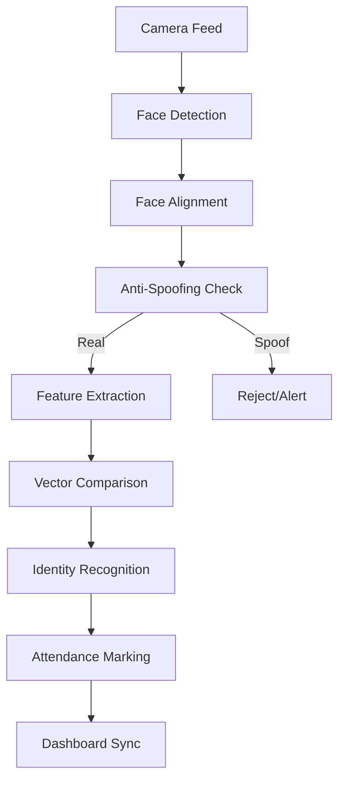

# System Architecture

The Facial Recognition Attendance System is designed as a modular, high-performance solution for automated school attendance. It uses a multi-stage pipeline to ensure accuracy and security.

## Core Pipeline

## Major Components

### 1. Attendance Engine (`core/attendance_engine.py`)

The orchestrator of the entire recognition pipeline. It manages the lifecycle of a frame from capture to identification.

### 2. Detection Module (`core/face_detector.py`)

Identifies facial bounding boxes and landmarks. Supports multiple backends:

- **MTCNN**: Robust and accurate.
- **RetinaFace**: State-of-the-art accuracy.
- **MediaPipe**: Extremely fast for edge devices.

### 3. Recognition Module (`core/face_recognizer.py`)

Extracts unique biometric "embeddings" (512-dimensional vectors).

- **FaceNet**: Balanced performance using Inception-ResNet.
- **ArcFace**: Superior discriminative power for large datasets.

### 4. Anti-Spoofing Module (`core/anti_spoof.py`)

Hardware-agnostic liveness detection using:

- **Texture Analysis**: Detects screen/print patterns.
- **Temporal Analysis**: Blink detection and micro-movements.
- **Frequency Analysis**: Identifies moiré patterns from digital displays.

## Data Flow

1. **Capture**: `CameraService` grabs frames in a background thread to minimize latency.
2. **Analysis**: `AttendanceEngine` processes frames using localized GPU/CPU inference.
3. **Storage**: `AttendanceDB` (SQLite) logs events locally for resilience.
4. **Integration**: `AttendanceService` pushes data to the central monitoring dashboard via Webhooks/REST API.
