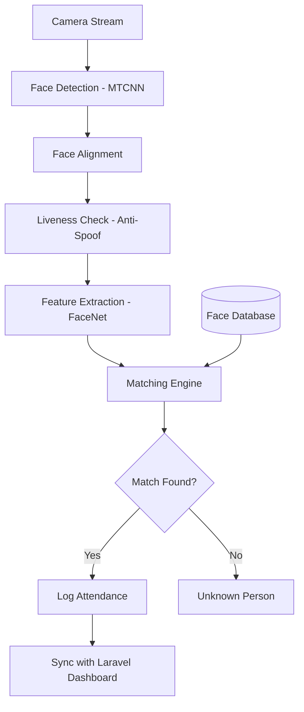

# 📸 Facial Recognition Attendance System: Technical Overview

## 📑 1. Introduction

The **Facial Recognition Attendance System** is a high-performance AI service designed to automate student attendance through biometric verification. It operates as a standalone Flask-based microservice that integrates with the central Smart School Dashboard.

---

## 🤖 2. Core AI Models

The system employs a multi-stage deep learning pipeline for maximum accuracy and security.

### 2.1 Face Detection: MTCNN / RetinaFace

- **Primary Model**: **MTCNN** (Multi-task Cascaded Convolutional Networks).
- **Function**: Detects human faces in the video stream and identifies 5 key facial landmarks (eyes, nose, mouth corners).
- **Alternative Backends**: Supports **RetinaFace** (higher accuracy) and **MediaPipe** (maximum speed).

### 2.2 Face Recognition: FaceNet (InceptionResnetV1)

- **Model**: **FaceNet** pretrained on VGGFace2.
- **Function**: Extracts a **512-dimensional embedding** (numerical representation) of the face.
- **Matching**: Uses **Cosine Similarity** to compare live embeddings against stored student templates.
- **Threshold**: Default similarity threshold is `0.65` for a "Match".

### 2.3 Anti-Spoofing: MediaPipe & Texture Analysis

- **Function**: Prevents fraud (e.g., using a photo or video of a student instead of their physical presence).
- **Mechanism**: Analyzes blinking patterns, head movement, and texture depth using MediaPipe landmarks.

---

## 🏗️ 3. System Architecture

---

## 📂 4. Project Structure & File Descriptions

### 📁 `core/` (The Brain)

- **`face_detector.py`**: Handles face localization and landmark detection.
- **`face_recognizer.py`**: Generates 512-D embeddings and performs similarity comparisons.
- **`face_aligner.py`**: Corrects head tilt and scales face images to 160x160 for the recognizer.
- **`anti_spoof.py`**: Logic for liveness detection and fraud prevention.
- **`attendance_engine.py`**: The main orchestrator that runs the full pipeline on a video frame.

### 📁 `services/` (Business Logic)

- **`registration_service.py`**: Manages the "Student Enrollment" process (captures 40 images, averages embeddings).
- **`attendance_service.py`**: Handles real-time check-in/check-out logic.
- **`camera_service.py`**: Manages multiple camera feeds and stream processing.

### 📁 `database/` (Data Layer)

- **`face_database.py`**: Stores high-dimensional face embeddings in a searchable format.
- **`attendance_db.py`**: Local SQLite log of attendance events before syncing to Laravel.
- **`models.py`**: SQLAlchemy definitions for Student and Attendance records.

### 📁 `api/` (Interface)

- **`routes/`**: Contains Flask Blueprints for:
  - `/api/register`: Enroll new students.
  - `/api/attendance`: Start/stop live attendance tracking.
  - `/api/camera`: Manage camera configurations.

### 📁 `training/`

- **`trainer.py`**: Utility to retrain or fine-tune local matching models.
- **`data_loader.py`**: Handles image augmentation and preprocessing for training.

### 📁 `utils/`

- **`image_utils.py`**: Helper functions for image manipulation (resizing, grayscale conversion, noise reduction).
- **`logger.py`**: Unified logging configuration for the entire system.
- **`validators.py`**: Input validation for student IDs and API requests.

### 📁 `config/`

- **`settings.py`**: Central configuration file where model paths, similarity thresholds, and port settings are defined. Loads values from `.env`.

### 📄 Root Files

- **`app.py`**: The main entry point (Flask application factory).
- **`requirements.txt`**: Lists all python dependencies.
- **`start_api.sh`**: Bash script to launch the service in the background.
- **`verify_engine.py`**: A diagnostic script to check if the AI models are loaded correctly.

---

## ⚙️ 5. How It Works (Step-by-Step)

### 5.1 Student Registration

1. **Capture**: System captures 40 consecutive frames of the student.
2. **Filter**: Images with low quality, blur, or no faces are discarded.
3. **Embed**: A vector is generated for each good image.
4. **Aggregate**: The system computes a **Median Embedding** to create a robust "Face Template".
5. **Save**: The template and a profile photo are saved to the database.

### 5.2 Attendance Marking

1. **Detect**: The system scans the camera feed 5–10 times per second.
2. **Align**: When a face is found, it is aligned so the eyes are level.
3. **Verify**: The liveness check ensures the person is physically there.
4. **Search**: The live embedding is compared against all registered students using matrix multiplication (very fast).
5. **Action**: If a student is identified with >65% confidence, their attendance is logged and sent to the Laravel Dashboard via HTTP.

---

## 🔌 6. Integration Points

- **Ports**: Runs on port `5004` by default.
- **API Endpoint**: Communicates with Laravel via `POST /api/attendance/log`.
- **CORS**: Configured to allow requests from the Smart School Dashboard (`127.0.0.1:8000`).

---

## 🛠️ 7. Dependencies

- **PyTorch**: Deep learning backend.
- **OpenCV**: Image processing and camera handling.
- **Mediapipe**: Landmarks and light-weight liveness detection.
- **SQLite/SQLAlchemy**: Fast local data storage.

---

## 📐 8. How Accuracy Is Calculated (Equations Used)

This system does not use a single "classification accuracy %" in runtime code. Instead, attendance decisions are made using similarity and threshold equations.

### 8.1 Embedding normalization

Each face embedding is L2-normalized:

- `e_norm = e / ||e||`

This ensures stable similarity comparison.

### 8.2 Cosine similarity (main matching equation)

Used in `core/face_recognizer.py`:

- `similarity = (e1 . e2) / (||e1|| * ||e2||)`

Range is `[-1, 1]`, where higher means more similar.

### 8.3 Multi-embedding score per student

Used in `core/attendance_engine.py`:

1. Compute similarities between query embedding and all stored embeddings of a student.
2. Sort descending and take top 3.
3. Student score is top-3 mean:

- `score_student = mean(top3(similarities))`

If only one embedding exists, fallback uses direct dot product against the stored normalized embedding matrix.

### 8.4 Ambiguity penalty

If top-1 and top-2 scores are very close (`difference < 0.04`), confidence is reduced:

- `score_top1 = score_top1 * 0.95`

This helps reduce false positives.

### 8.5 Recognition decision rule

A face is recognized only when:

- `score_top1 >= recognition_threshold`

Current threshold values come from configuration/engine initialization (for example around `0.55` to `0.65`, depending on active settings).

### 8.6 Attendance marking decision rule

Attendance is marked only when all checks pass:

- `is_recognized == True`
- `is_live == True` (anti-spoof/liveness pass)
- cooldown condition is satisfied (`elapsed_seconds >= ATTENDANCE_COOLDOWN_SECONDS`)

So practical attendance "accuracy" is controlled by similarity threshold + liveness threshold + cooldown logic, not by one standalone equation.
