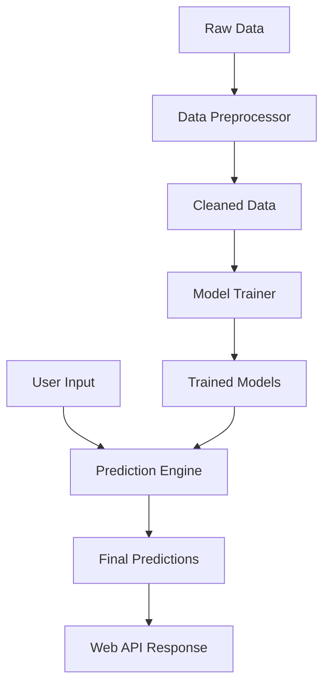

# System Architecture

The Student Performance Prediction system is built with a decoupled architecture, separating the core ML engine from the API layer for maximum scalability.

## Data Flow Diagram

## Core Components

### 1. Data Processing Layer (`src/data_preprocessing.py`)

Responsible for converting raw school records into a format suitable for machine learning.

- **Cleaning**: Handles missing IDs, fills null values, and standardizes data types.
- **Subject Expansion**: Converts wide-format student records into deep subject-wise records.
- **Feature Engineering**: Injects domain knowledge into the dataset via derived features.

### 2. Training Layer (`src/model_trainer.py`)

Orchestrates the model development lifecycle.

- **One-Hot Encoding**: Transforms categorical subjects into binary vectors.
- **Stratified Sampling**: Ensures the training set represents all performance levels (low/medium/high).
- **Cross-Validation**: Uses 5-fold CV to provide a robust performance baseline.

### 3. Prediction Layer (`src/predictor.py`)

The high-performance inference engine used in production.

- **Inference Pipeline**: Mirrors the training preprocessing exactly to avoid data leakage.
- **Confidence Estimation**: Dynamically calculates the 95% confidence interval based on input quality.
- **Clamping**: Ensures outputs are physically possible (0-100%).

### 4. API Layer (`api/app.py`)

A lightweight Flask-based REST service that exposes the prediction logic to the external world.

- Supports single-student predictions.
- Supports batch processing for entire classrooms.
- Includes a health-check endpoint for monitoring.
