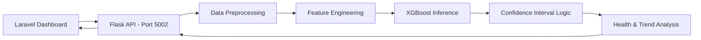

# 📊 Student Performance Prediction Model: Technical Overview

## 📑 1. Introduction

The **Student Performance Prediction Model** is a machine learning service that forecasts student academic outcomes. It uses historical term marks, attendance data, and demographic factors to predict future grades and identify students at risk of academic decline.

---

## 🤖 2. Core AI Model

The system is built on a modern regression pipeline optimized for tabular school data.

### 2.1 Algorithm: XGBoost (Extreme Gradient Boosting)

- **Model Type**: `XGBRegressor`.
- **Selection Reason**: High accuracy on small-to-medium datasets, excellent handling of non-linear relationships, and built-in feature importance tracking.
- **Optimization**: 5-Fold Cross-Validated and tuned using `scikit-optimize`.

### 2.2 Feature Engineering (The Secret Sauce)

The model doesn't just look at raw marks; it creates **9 sophisticated derived features**:

- **`marks_slope`**: Measures the velocity of improvement or decline over 3 terms.
- **`marks_volatility`**: Captures how much a student's marks fluctuate (stability metric).
- **`is_crashing`**: A binary flag for sudden performance drops (>30 points).
- **`attendance_marks_interaction`**: Captures how attendance multiplies the effect of study effort.
- **`performance_momentum`**: A weighted metric combining latest marks and attendance.

---

## 🏗️ 3. System Architecture



---

## 📂 4. Project Structure & File Descriptions

### 📁 `src/` (Core Logic)

- **`predictor.py`**: The main inference engine. Loads models, prepares data, and calculates 95% Confidence Intervals.
- **`data_preprocessing.py`**: Handles cleaning, scaling (using `scaler.pkl`), and encoding (One-Hot Encoding for subjects).
- **`model_trainer.py`**: The pipeline used to train the model on synthetic or real datasets.

### 📁 `models/` (Serialized Assets)

- **`performance_predictor.pkl`**: The trained XGBoost model.
- **`scaler.pkl`**: Standardizes numerical inputs (Age, Marks, Attendance).
- **`subject_encoder.pkl`**: One-Hot Encoder mapping subject names to binary vectors.
- **`feature_order.pkl`**: Ensures features are fed to the model in the correct sequence.

### 📁 `api/` (Interface)

- **`app.py`**: Flask server exposing the `/predict` and `/predict/batch` endpoints.

### 📁 `dataset/`

- Contains training CSVs and historical mark data.

---

## ⚙️ 5. How It Works (Step-by-Step)

### 5.1 The Prediction Pipeline

1. **Input**: Receiving student data (Age, Grade, Subject, Term 1-3 Marks, Attendance).
2. **Preprocessing**:
   - Numerical values are scaled.
   - Subjects are One-Hot Encoded (gracefully handles unknown subjects).
3. **Inference**: XGBoost generates a point prediction (e.g., `82.5`).
4. **Reliability Calculation**:
   - The system calculates a **95% Confidence Interval**.
   - If a student has low attendance or highly volatile marks, the "Uncertainty Range" widens.
5. **Trend Analysis**: Categorizes the student as **Improving, Declining, Stable, or Fluctuating**.

### 5.2 Output JSON Example

```json
{
  "subject": "Mathematics",
  "predicted_performance": 82.5,
  "confidence_interval": {
    "lower_bound": 74.2,
    "upper_bound": 90.8,
    "confidence_level": 0.95
  },
  "prediction_trend": "Improving",
  "performance_category": "Good",
  "recommendation": "Great potential! Keep up the good work"
}
```

---

## 🔌 6. Integration Points

- **Port**: `5002`.
- **Protocol**: HTTP/JSON.
- **Dashboard**: The Laravel `StudentController` calls this API when viewing a student's profile or the "AI Prediction" tab.

---

## 🛠️ 7. Development Tools

- **Jupyter Notebooks**: Used for initial EDA and model accuracy analysis.
- **`test_system.py`**: End-to-end verification of the prediction pipeline.
- **`verify_trends.py`**: Specifically tests the trend detection logic against edge cases.

---

## 📐 8. How Accuracy Is Calculated (Equations Used)

The project evaluates prediction quality in `evaluate_model.py` using regression metrics.

### 8.1 Core error metrics

- **MAE (Mean Absolute Error)**
  - `MAE = (1/n) * sum(|y_i - y_hat_i|)`
  - Interpretation: average absolute error in score points.

- **MSE (Mean Squared Error)**
  - `MSE = (1/n) * sum((y_i - y_hat_i)^2)`

- **RMSE (Root Mean Squared Error)**
  - `RMSE = sqrt(MSE)`
  - Penalizes large errors more strongly than MAE.

- **MAPE (Mean Absolute Percentage Error)**
  - `MAPE = (100/n) * sum(|(y_i - y_hat_i) / y_i|)`

### 8.2 Variance explanation metrics

- **R² (Coefficient of Determination)**
  - `R² = 1 - (sum((y_i - y_hat_i)^2) / sum((y_i - y_mean)^2))`
  - Shows how much variance in future performance is explained by the model.

- **Adjusted R²**
  - `Adjusted R² = 1 - (1 - R²) * (n - 1) / (n - p - 1)`
  - Where:
    - `n` = number of test samples
    - `p` = number of features
  - Used to account for model complexity.

### 8.3 Practical "accuracy" thresholds used in this project

In addition to R², this project reports accuracy as the percentage of predictions within fixed error bounds:

- **Accuracy within ±5 points**
  - `Accuracy_±5 = (count(|y_i - y_hat_i| <= 5) / n) * 100`

- **Accuracy within ±10 points**
  - `Accuracy_±10 = (count(|y_i - y_hat_i| <= 10) / n) * 100`

This gives an easy classroom interpretation of model quality (how often predictions are close enough to real marks).
